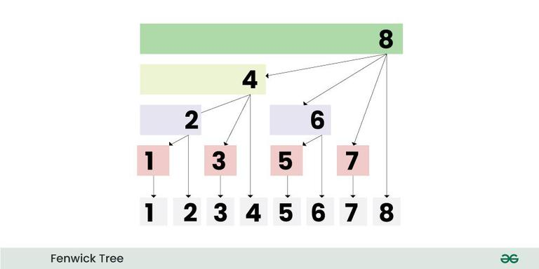

# **What is Fenwick Tree?**

Fenwick Tree or Binary Indexed Tree is a data structure used to calculate range queries along with updating the elements of the array, such that each query or update takes logarithmic time complexity. It is used to calculate prefix sums or running total of values up to any index.

# Idea behind fenwick tree : -
- Consider Fenwick tree as an array F[] with 1-based indexing, such that every index of array stores Partial Sum of range. For simplicity, assume the size of F[] to be 16. Now, if we have queries to calculate the range sum in an array. So, for any index i, F[i] will store the sum of values from index j+1 to i, such that j = i – (rightmost set bit of i). 

# Fenwick Tree Implementation for Range Queries and Updates:

- Since, we are storing Partial Sums of range in the Fenwick Tree F[], then updating an element at index i in the original array should reflect in all those indices of F[] which have index i in their partial sum range. For eg: if we want to update the element at index 5 in the original array, then it should reflect in F[5], F[6] and F[8] because F[5] stores the partial sum of range [5, 5], F[6] stores the partial sum of range [5, 6] and F[8] stores the partial sum of range [1, 8] and 5 lies in the range of all of them.

- Add X to 5th index, means adding X to F[5], F[6] and F[8],
5 –add right most set bit –> 6 –add right most set bit –> 8 — add right most set bit –> 16 (out of range)

- Add X to 9th index, means adding X to F[9], F[10] and F[12],
9 –add right most set bit –> 10 –add right most set bit –> 12 –add right most set bit –> 16 (out of range)